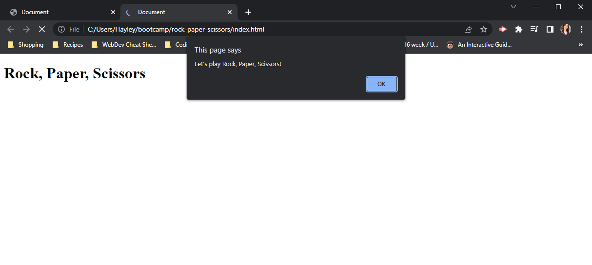
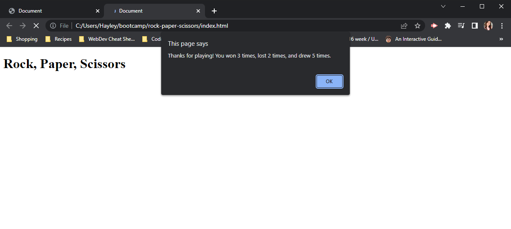

# Rock, Paper, Scissors Game

## Description

This is a game made entirely with Javascript, in which you play rock, paper, scissors against a computer opponent. The game is played through alerts on the page and lasts for 10 rounds, after which the user is shown how many wins, losses and draws they had.

This game was created to test if I could apply my basic learning of Javascript. In time I hope to return and improve the game by using a method other than alerts and prompts to play the game, and perhaps adding CSS styling.

[Click here](https://codenamehaylz.github.io/rock-paper-scissors/) to go to the deployed site.

Please note that the lack of commits is because I had mostly built the game in class with no intention of adding it to github. Then when I realised I had managed to create an actual working game, I decided it would be best to display it. Once I come back to add improvements, I will be able to show my working with more commits.

## Usage

Follow the instructions of the pop up alerts to play through the game. Type r, p, or s to represent your choice of weapon (Rock, Paper, or Scissors). The computer will randomly choose a weapon also. An alert will then tell you the choices and the outcome of the round, then ask if you want to play again. After 10 rounds, an alert will thank you for playing and display your final scores.

You can also open the console log to see the scores again.

If you enter anything other than r, p or s when prompted, then that round will not count and will not show on the final scores.

## License
MIT License.